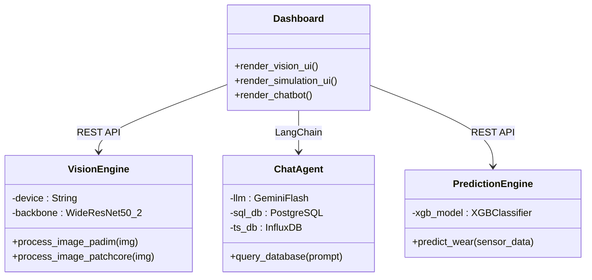
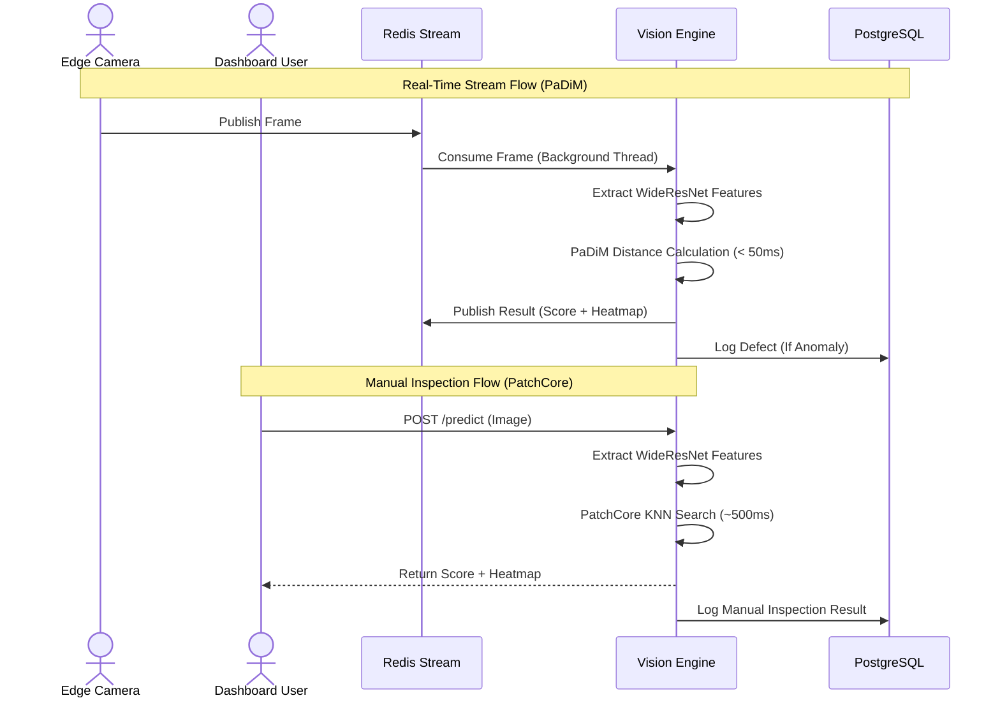

# KAVE Intelligent Manufacturing — Full Enterprise Documentation

## Table of Contents
1. [Project Overview](#1-project-overview)
2. [Architecture Highlights](#2-architecture-highlights)
3. [Tech Stack](#3-tech-stack)
4. [Prerequisites & Installation](#4-prerequisites--installation)
5. [File Structure](#5-file-structure)
6. [API Endpoints Reference](#6-api-endpoints-reference)
7. [System & UML Diagrams](#7-system--uml-diagrams)

---

## 1. Project Overview
**KAVE Intelligent Manufacturing** is a state-of-the-art Enterprise Digital Twin designed to monitor, inspect, and optimize modern CNC machining workflows. By fusing High-Frequency IoT telemetry, Machine Learning (XGBoost), and deep learning computer vision, KAVE provides a robust real-time command center for production floors.

The platform exists to solve two critical manufacturing challenges:
1. **Unplanned Downtime:** Predicting CNC tool wear before catastrophic failure.
2. **Quality Control Bottlenecks:** Instantly identifying defective parts (e.g., metal nuts) without slowing down the assembly line.

---

## 2. Architecture Highlights
The core of our defect detection relies on a **Dual-Pipeline Vision Engine** that balances speed and accuracy using a shared `WideResNet-50-2` backbone:

- **PaDiM (Real-Time Streaming):** Handles extreme high-throughput video streams via Redis. By leveraging Mahalanobis distance over multivariate Gaussian distributions, PaDiM achieves sub-second latency for instant edge-camera inspection.
- **PatchCore (Manual Deep Inspection):** Handled via FastAPI REST endpoints for manual, on-demand high-precision anomaly detection using a K-Nearest Neighbors (KNN) memory bank. 
- **Gemini 1.5 Flash (AI Agent):** A dual-database Chatbot (PostgreSQL + InfluxDB) that translates human queries into complex SQL/Flux analytics instantly.

---

## 3. Tech Stack
- **Infrastructure & Orchestration:** Docker, Docker Compose
- **Backend & APIs:** FastAPI, Python 3.10+
- **Frontend / UI:** Streamlit
- **Computer Vision & AI:** PyTorch, OpenCV, Albumentations, Gemini 1.5 Flash API
- **Machine Learning:** XGBoost (scikit-learn)
- **Data & Streaming:** Redis (Streams), InfluxDB (Time-series), PostgreSQL (Relational)
- **Monitoring & BI:** Grafana

---

## 4. Prerequisites & Installation

### Prerequisites
- Docker Engine and Docker Compose V2
- NVIDIA GPU (Optional but recommended for PyTorch CUDA acceleration)
- Gemini API Key

### Setup Environment
Clone the repository and configure the environment variables:
```bash
cp .env.example .env
```
Edit the `.env` file to include your API keys:
```env
GEMINI_API_KEY="your_google_gemini_api_key_here"
POSTGRES_USER=admin
POSTGRES_PASSWORD=kave_pass
```

### Build & Run the Platform
Deploy the entire microservice architecture using Docker Compose:
```bash
docker compose up -d --build
```

### Access the Dashboards
- **Master Streamlit Dashboard:** [http://localhost:8501](http://localhost:8501)
- **Grafana IoT Analytics:** [http://localhost:3000](http://localhost:3000)
- **Vision Engine API Docs:** [http://localhost:8000/docs](http://localhost:8000/docs)

---

## 5. File Structure

```text
KAVE-Intelligent-Manufacturing/
├── docker-compose.yml
├── .env.example
├── README.md
├── FULL_DOCUMENTATION.md
├── UML_DIAGRAMS.md
├── data-processing/
│   ├── ai_training/               
│   └── data_generation/           
└── services/
    ├── dashboard/                 # Streamlit UI (Port 8501)
    ├── grafana/                   # Grafana Dashboards (Port 3000)
    ├── iot-bridge/                # CNC Sensor Ingest to InfluxDB
    ├── prediction-engine/         # XGBoost Predictive Planning API
    ├── vision-engine/             # Dual-Pipeline FastAPI (PaDiM + PatchCore)
    └── vision-producer/           # RTSP/Camera to Redis Stream ingest
```

---

## 6. API Endpoints Reference

### Vision Engine API (`kave_vision_engine:8000`)

#### `POST /predict`
- **Description:** Runs manual deep inspection (PatchCore) on an uploaded image.
- **Payload:** `multipart/form-data` containing the image file.
- **Response:**
  ```json
  {
    "filename": "nut_001.png",
    "score": 1.4532,
    "heatmap_b64": "<base64_encoded_png>",
    "inference_ms": 482.1
  }
  ```

#### `GET /config`
- **Description:** Retrieves the current vision engine configuration.
- **Response:**
  ```json
  {
    "threshold": 0.5,
    "model": "PatchCore/PaDiM Dual-Pipeline",
    "backbone": "WideResNet-50-2"
  }
  ```

### Prediction Engine API (`kave_prediction_engine:8001`)

#### `POST /predict`
- **Description:** Predicts CNC tool wear stage and confidence level using XGBoost.
- **Payload:** JSON array of sensor readings `[x_vibration, z_vibration, ...]`
- **Response:**
  ```json
  {
    "prediction_stage": 2,
    "confidence_percent": 87.5
  }
  ```

---

## 7. System & UML Diagrams

### Class Diagram


### Component Diagram
```mermaid
componentDiagram
    package "Frontend" {
        [Streamlit Dashboard]
        [Grafana]
    }
    package "AI Microservices" {
        [Vision Engine]
        [Prediction Engine]
    }
    package "Databases" {
        [PostgreSQL]
        [InfluxDB]
        [Redis]
    }
    
    [Streamlit Dashboard] --> [Vision Engine] : HTTP POST
    [Streamlit Dashboard] --> [Prediction Engine] : HTTP POST
    [Streamlit Dashboard] --> [PostgreSQL] : Read Logs
    [Vision Engine] --> [Redis] : Pub/Sub
    [Prediction Engine] --> [InfluxDB] : Read Telemetry
```

### Deployment Diagram
```mermaid
flowchart TB
    subgraph Host[Host Machine (Docker Engine)]
        subgraph Network[kave_network]
            UI[kave_dashboard :8501]
            Grafana[kave_grafana :3000]
            Vision[kave_vision_engine :8000]
            Pred[kave_prediction_engine :8001]
            PG[(kave_db :5432)]
            Influx[(kave_influx_db :8086)]
            Redis[(kave_redis :6379)]
        end
    end
    UI --> Vision
    UI --> PG
    UI --> Influx
    Vision --> Redis
    Vision --> PG
    Grafana --> Influx
    Grafana --> PG
```

### Sequence Diagram (Dual-Pipeline Flow)


### Timing Diagram

```mermaid
gantt
    title Inference Latency Comparison
    dateFormat  s
    axisFormat %S
    
    section PaDiM (Stream)
    Feature Extraction :a1, 0, 0.02s
    Mahalanobis Dist   :a2, after a1, 0.01s
    Redis Publish      :a3, after a2, 0.01s
    
    section PatchCore (API)
    Feature Extraction :b1, 0, 0.02s
    Coreset KNN Search :b2, after b1, 0.5s
    HTTP Response      :b3, after b2, 0.05s
```

