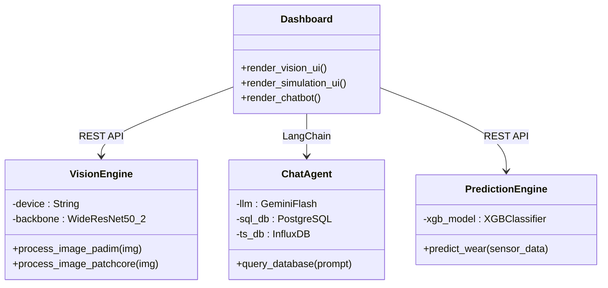
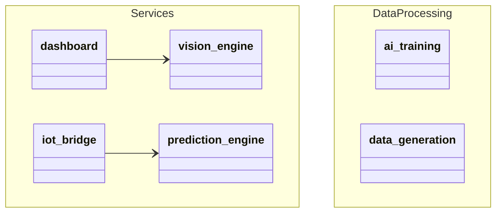
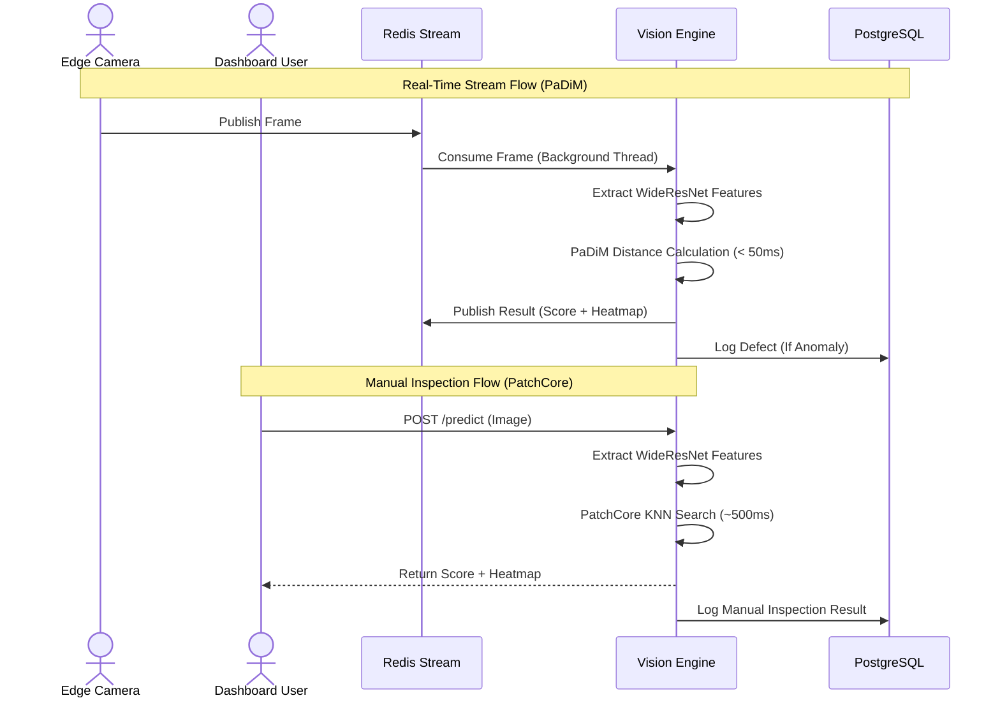
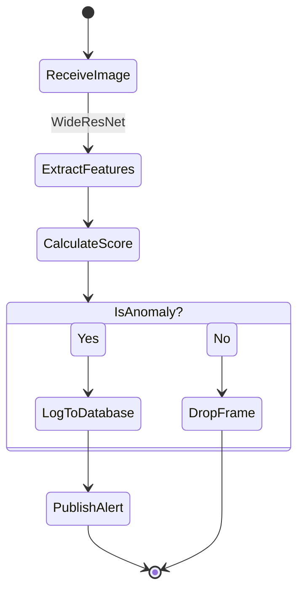
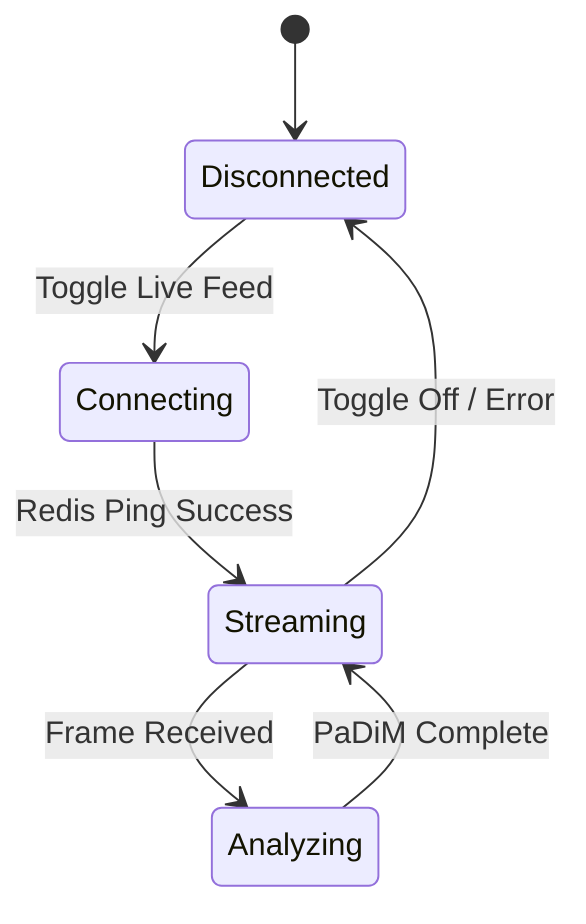
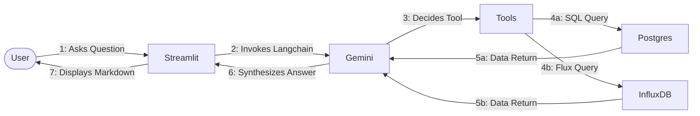

# KAVE Intelligent Manufacturing — UML & System Diagrams

The following diagrams illustrate the architecture, behavior, and structural components of the KAVE Intelligent Manufacturing Digital Twin using Mermaid.js.

## 1. Class Diagram
Illustrates the core system entities and their relationships.


## 2. Object Diagram
Shows an instance snapshot of the system in production.
```mermaid
objectDiagram
    object RedisStream {
        name = "results_stream"
        throughput = "30 FPS"
    }
    object PaDiMWorker {
        state = "listening"
        model = "Gaussian Stats"
    }
    object APIEndpoint {
        route = "/predict"
        model = "PatchCore KNN"
    }
    
    PaDiMWorker --|> RedisStream : Consumes/Publishes
    APIEndpoint --|> PaDiMWorker : Shares WideResNet Backbone
```

## 3. Component Diagram
Details the microservice boundaries.
```mermaid
componentDiagram
    package "Frontend" {
        [Streamlit Dashboard]
        [Grafana]
    }
    package "AI Microservices" {
        [Vision Engine]
        [Prediction Engine]
    }
    package "Databases" {
        [PostgreSQL]
        [InfluxDB]
        [Redis]
    }
    
    [Streamlit Dashboard] --> [Vision Engine] : HTTP POST
    [Streamlit Dashboard] --> [Prediction Engine] : HTTP POST
    [Streamlit Dashboard] --> [PostgreSQL] : Read Logs
    [Vision Engine] --> [Redis] : Pub/Sub
    [Prediction Engine] --> [InfluxDB] : Read Telemetry
```

## 4. Deployment Diagram
Shows the Docker network architecture.
```mermaid
flowchart TB
    subgraph Host[Host Machine (Docker Engine)]
        subgraph Network[kave_network]
            UI[kave_dashboard :8501]
            Grafana[kave_grafana :3000]
            Vision[kave_vision_engine :8000]
            Pred[kave_prediction_engine :8001]
            PG[(kave_db :5432)]
            Influx[(kave_influx_db :8086)]
            Redis[(kave_redis :6379)]
        end
    end
    UI --> Vision
    UI --> PG
    UI --> Influx
    Vision --> Redis
    Vision --> PG
    Grafana --> Influx
    Grafana --> PG
```

## 5. Package Diagram
Shows code organization within the repository.


## 6. Composite Structure Diagram
Internal structure of the Vision Engine.
```mermaid
blockBeta
  columns 3
  API["FastAPI App"]:1
  space:1
  Redis["Redis Consumer"]:1
  
  block:Backbone
    WRN["WideResNet-50-2 Backbone"]
  end
  
  API -- "Feature Extraction" --> Backbone
  Redis -- "Feature Extraction" --> Backbone
  
  Backbone -- "PatchCore KNN" --> API
  Backbone -- "PaDiM Stats" --> Redis
```

## 7. Use Case Diagram
User interactions with the digital twin.
```mermaid
usecaseDiagram
    actor PlantManager as "Plant Manager"
    actor QualityInspector as "Quality Inspector"
    
    usecase UC1 as "View Live CNC Dashboards"
    usecase UC2 as "Upload Part for Deep Inspection"
    usecase UC3 as "Chat with AI Agent (Gemini)"
    usecase UC4 as "Simulate Production Scheduling"
    
    PlantManager --> UC1
    PlantManager --> UC3
    PlantManager --> UC4
    QualityInspector --> UC2
    QualityInspector --> UC1
```

## 8. Sequence Diagram
Dual-Pipeline flow (Real-Time vs Manual).


## 9. Activity Diagram
Defect logging process.


## 10. State Machine Diagram
Camera/Stream state.


## 11. Communication Diagram
Interaction between components during AI Chat.


## 12. Timing Diagram
Latency comparison of the dual pipeline.

```mermaid
gantt
    title Inference Latency Comparison
    dateFormat  s
    axisFormat %S
    
    section PaDiM (Stream)
    Feature Extraction :a1, 0, 0.02s
    Mahalanobis Dist   :a2, after a1, 0.01s
    Redis Publish      :a3, after a2, 0.01s
    
    section PatchCore (API)
    Feature Extraction :b1, 0, 0.02s
    Coreset KNN Search :b2, after b1, 0.5s
    HTTP Response      :b3, after b2, 0.05s
```

